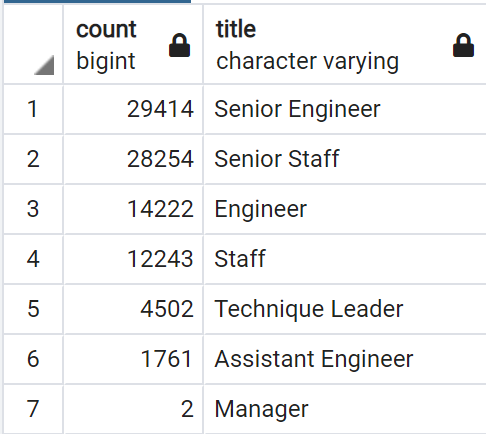
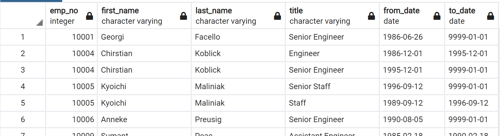
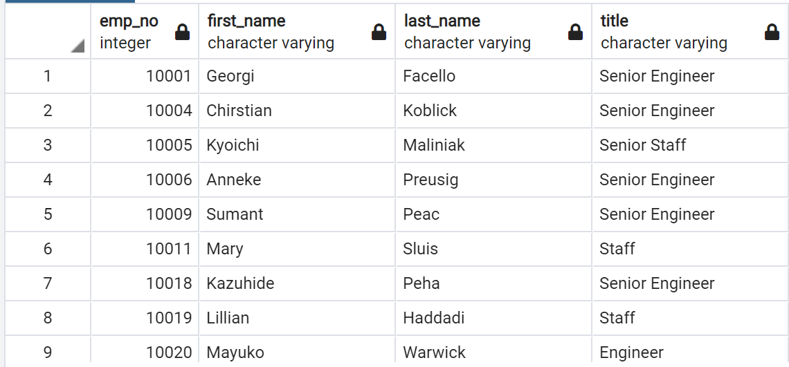
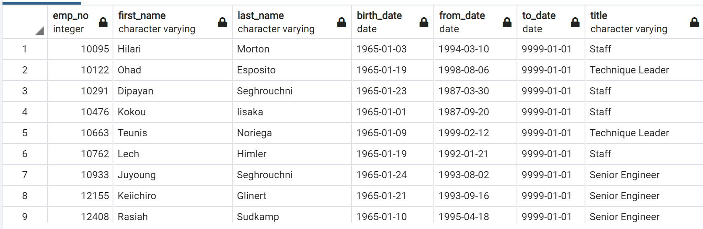

# Pewlett-Hackard-Analysis

## Overview: 
We've determine the number of retiring employees per title, and identify employees who are eligible to participate in a mentorship program. The analysis should help prepare Bobby's manager for the "silver tsunami" as many current employees reach retirement age. 

## Results: 
- We first collected the data in retiring_titles.csv in the Data folder where shows the amount of employees that are ready for retirement by thier title.

- We then got a list of the employees retiring, however it has duplicates of employees that have been promoted through their careers. 

- We then update the list to their most recent title.

- Finally we've gotten a list of the employees who are ready for mentorship.

## Summary: 
There are 90398 employees who will be retiring during this "silver tsunami" who can mentor employees before they embark on their new journey. There are currently 1549 people who are elligible for mentorship, while that seems like a low number it does not mean that the working environment will be overbaring when thye retire. Technology is improving as each day passes and hopefully the new generation is also adaptive which can compensate the amount of employees retiring.

